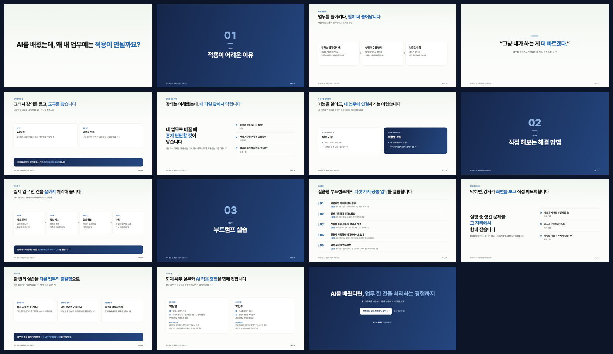
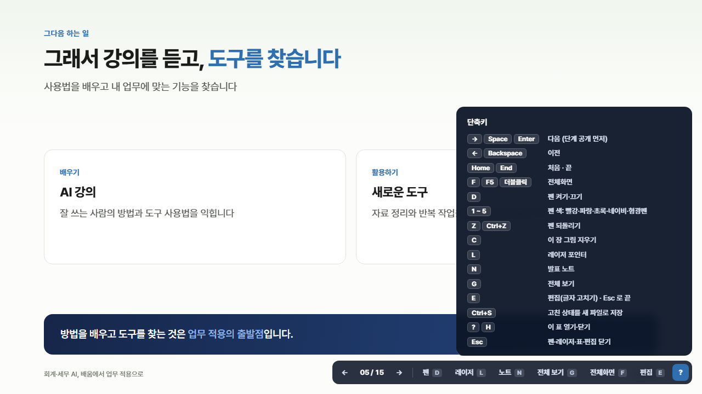

# kernel-slides

원데이 AI Bootcamp([bootcamp.kernelacademy.io](https://bootcamp.kernelacademy.io)) 사이트와 같은 디자인으로 **HTML 강의안(16:9, 파일 하나)** 을 만드는 Claude Code 스킬.

대본·아웃라인·마크다운·기존 강의안을 주면 커널 테마 슬라이드를 만들고, 넘침·빈 공간·줄바꿈을 브라우저로 실측해 검사한 뒤 PDF 까지 뽑는다. 만들어진 HTML 에는 발표 노트, 펜·형광펜, 레이저 포인터, 전체화면, 단축키 표가 들어 있어 유튜브 녹화나 현장 강의에 바로 쓴다.



## 설치

```bash
git clone https://github.com/minsooparkk/kernel-slides.git ~/.claude/skills/kernel-slides
```

Windows 에서는 `C:\Users\<사용자>\.claude\skills\kernel-slides` 에 이 폴더를 두면 된다.
Claude Code 에서 "커널 테마로 강의안 만들어줘", "이 대본으로 부트캠프 디자인 슬라이드" 처럼 요청하면 스킬이 동작한다.

**필요한 것:** Python 3, Chrome 또는 Edge(검사·스크린샷·PDF 용), 인터넷(Pretendard 글꼴). Pillow 가 있으면 한눈 보기 이미지도 만든다.

## 구성

| 파일 | 내용 |
|---|---|
| `SKILL.md` | 스킬 본문 — 디자인 원칙, 만드는 순서, 발표 기능 |
| `assets/template.html` | 디자인과 발표 기능이 모두 들어 있는 템플릿. 견본 장 포함 |
| `assets/layouts.md` | 장 종류, 본문 부품, 분량, 색 규칙 |
| `assets/writing.md` | 화면 문구 분량과 피할 문체 |
| `scripts/check.py` | 실측 검사 · 스크린샷 · PDF |
| `CHANGELOG.md` | 변경 이력 |

## 검사와 PDF

```bash
python scripts/check.py 강의안.html --shots ./shots   # 장마다 검사 + 스크린샷 + 한눈 보기
python scripts/check.py 강의안.html --pdf 강의안.pdf   # 한 장 = 한 쪽 PDF
```

## 발표 중 단축키



| 키 | 하는 일 |
|---|---|
| `→` `Space` `Enter` / `←` `Backspace` | 다음 / 이전 |
| `F` · `F5` · 더블클릭 | 전체화면 |
| `D` | 펜 (`1`~`5` 색, `Z` 되돌리기, `C` 지우기) |
| `L` | 레이저 포인터 |
| `N` | 발표 노트 |
| `G` | 전체 보기 |
| `E` / `Ctrl+S` | 글자 편집 / 새 파일로 저장 |
| `?` | 단축키 표 |

한/영이 한글이어도 단축키가 먹는다. 오른쪽 아래 조작 막대는 마우스를 멈추면 숨는다.

유튜브 녹화용(화면 아래 자막 띠·오른쪽 아래 얼굴 캠 자리를 비우는 배치)은 [youtube-lecture-slides](https://github.com/minsooparkk/youtube-lecture-slides). 이 스킬에서도 `body` 에 `data-video="on"` 을 붙이면 같은 배치가 켜진다.

## 라이선스

[MIT](LICENSE)
